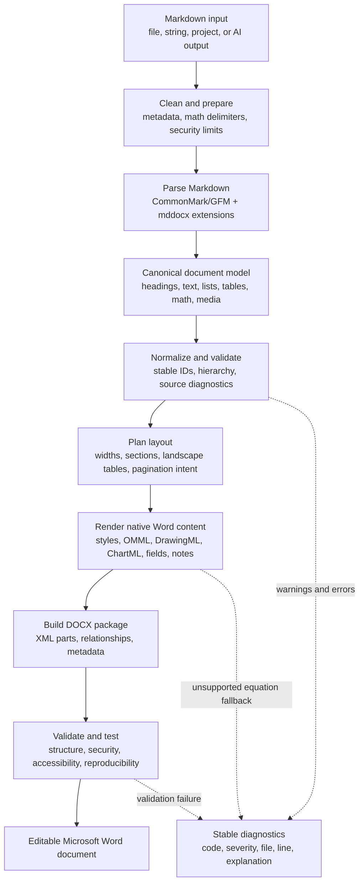
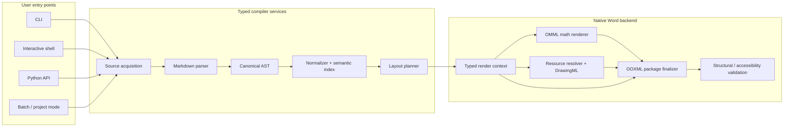
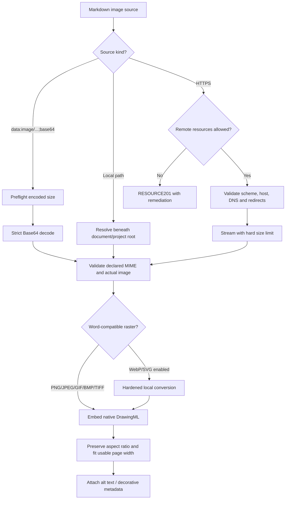

# How mddocx works

mddocx is a Markdown-to-Word compiler. It converts content into native Word
elements instead of taking a screenshot or flattening the document. Equations
remain editable OMML, charts remain editable ChartML with an embedded workbook,
and headings, lists, tables, notes, references, and images remain structured.

## Component architecture

## Image-resource decision flow

The `data:` branch is always local and never consults the network preference. Public HTTPS is
allowed by the library and ordinary CLI by default. On the first interactive-shell launch, the
user can choose to block it; the shell stores only that boolean preference. Even when HTTPS is
allowed, private/reserved addresses, unsafe redirects, invalid MIME types, oversized downloads,
and external SVG references remain blocked.

## Stages

1. **Clean and prepare** removes high-confidence AI/chat export metadata,
   recognizes equation syntax commonly emitted by ChatGPT, Claude, Gemini, and
   other LaTeX-producing systems, protects code and currency text, and applies
   input/resource limits.
2. **Parse** converts CommonMark/GFM and documented mddocx extensions into a
   canonical AST. The parser does not execute Markdown, TeX, code, or remote
   resources.
3. **Normalize and validate** removes parser quirks, coalesces text, normalizes
   math, assigns stable heading identifiers, checks hierarchy and table shape,
   and records source-located diagnostics.
4. **Plan layout** makes page-sensitive decisions before OOXML is written. For
   example, a wide table can receive a deterministic landscape section and the
   following content can return to portrait orientation.
5. **Render** maps the AST to editable Word structures: OMML equations,
   DrawingML images, ChartML charts, Word numbering, fields, bookmarks,
   footnotes/endnotes, citations, headers, footers, and tables.
6. **Finalize and validate** scrubs generated metadata when configured,
   produces deterministic package parts, checks relationships and XML safety,
   and exposes structural, accessibility, performance, LibreOffice, and Word
   365 qualification checks.

The v1 façade (`render`, `render_string`, and `MarkdownWord`) remains available.
The staged `Compiler` additionally exposes parse, normalize, plan, render, check,
and compile operations with typed results and diagnostics.

The supported construct contract is maintained in
[`feature-matrix.json`](feature-matrix.json). Word 365 is the primary output
authority; LibreOffice is used as a secondary automated rendering signal.
