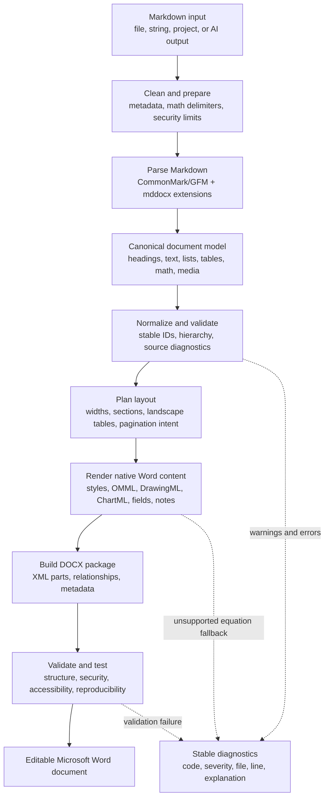
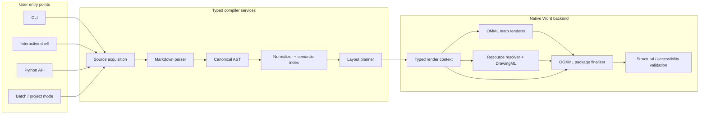
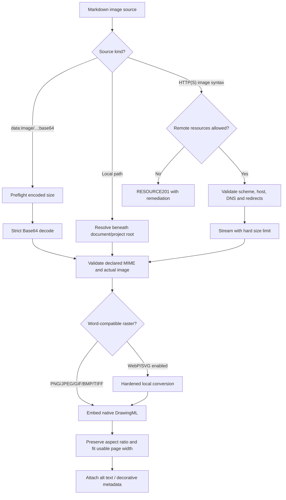

# How mddocx works

mddocx is a Markdown-to-Word compiler. It converts content into native Word
elements instead of taking a screenshot or flattening the document. Equations
remain editable OMML, charts remain editable ChartML with an embedded workbook,
and headings, lists, tables, notes, references, and images remain structured.

```mermaid
flowchart TD
    A["Markdown input<br/>file, string, project, or AI output"]
    B["Clean and prepare<br/>metadata, math delimiters, security limits"]
    C["Parse Markdown<br/>CommonMark/GFM + mddocx extensions"]
    D["Canonical document model<br/>headings, text, lists, tables, math, media"]
    E["Normalize and validate<br/>stable IDs, hierarchy, source diagnostics"]
    F["Plan layout<br/>widths, sections, landscape tables, pagination intent"]
    G["Render native Word content<br/>styles, OMML, DrawingML, ChartML, fields, notes"]
    H["Build DOCX package<br/>XML parts, relationships, metadata"]
    I["Validate and test<br/>structure, security, accessibility, reproducibility"]
    J["Editable Microsoft Word document"]

    A --> B --> C --> D --> E --> F --> G --> H --> I --> J

    E -. "warnings and errors" .-> K["Stable diagnostics<br/>code, severity, file, line, explanation"]
    G -. "unsupported equation fallback" .-> K
    I -. "validation failure" .-> K
```

## Component architecture

```mermaid
flowchart LR
    subgraph Entry["User entry points"]
        CLI["CLI"]
        SHELL["Interactive shell"]
        API["Python API"]
        BATCH["Batch / project mode"]
    end

    subgraph Core["Typed compiler services"]
        ACQ["Source acquisition"]
        PARSER["Markdown parser"]
        AST["Canonical AST"]
        NORM["Normalizer + semantic index"]
        PLAN["Layout planner"]
    end

    subgraph Output["Native Word backend"]
        CTX["Typed render context"]
        MATH["OMML math renderer"]
        MEDIA["Resource resolver + DrawingML"]
        DOCX["OOXML package finalizer"]
        VALIDATE["Structural / accessibility validation"]
    end

    CLI --> ACQ
    SHELL --> ACQ
    API --> ACQ
    BATCH --> ACQ
    ACQ --> PARSER --> AST --> NORM --> PLAN --> CTX
    CTX --> MATH --> DOCX
    CTX --> MEDIA --> DOCX
    CTX --> DOCX --> VALIDATE
```

## Image-resource decision flow

```mermaid
flowchart TD
    SRC["Markdown image source"] --> KIND{"Source kind?"}
    KIND -->|"data:image/...;base64"| DATA["Preflight encoded size"]
    DATA --> DECODE["Strict Base64 decode"]
    DECODE --> MIME["Validate declared MIME and actual image"]
    KIND -->|"Local path"| CONTAIN["Resolve beneath document/project root"]
    CONTAIN --> MIME
    KIND -->|"HTTP(S) image syntax"| PREF{"Remote resources allowed?"}
    PREF -->|"No"| R201["RESOURCE201 with remediation"]
    PREF -->|"Yes"| HOST["Validate scheme, host, DNS and redirects"]
    HOST --> SIZE["Stream with hard size limit"]
    SIZE --> MIME
    MIME --> FORMAT{"Word-compatible raster?"}
    FORMAT -->|"PNG/JPEG/GIF/BMP/TIFF"| EMBED["Embed native DrawingML"]
    FORMAT -->|"WebP/SVG enabled"| CONVERT["Hardened local conversion"]
    CONVERT --> EMBED
    EMBED --> FIT["Preserve aspect ratio and fit usable page width"]
    FIT --> ALT["Attach alt text / decorative metadata"]
```

The `data:` branch is always local and never consults the network preference. Public HTTP(S) is
allowed by the library and ordinary CLI by default. On the first interactive-shell launch, the
user can choose to block it; the shell stores only that boolean preference. Even when HTTPS is
allowed, private/reserved addresses, unsafe redirects, invalid MIME types, oversized downloads,
and external SVG references remain blocked. Non-image responses and acquisition failures become
clickable figure fallbacks unless strict-image mode is selected; ordinary links never enter this flow.

## Module ownership

Each concern has exactly one owner, and data flows one way: configuration and text come in,
WordprocessingML goes out.

| Concern | Owner | Depends on |
|---|---|---|
| Which script is this text? | [`scripts.py`](../src/mddocx/scripts.py) | Unicode data only |
| Which font does each slot use? | [`styles/fonts.py`](../src/mddocx/styles/fonts.py) | `config`, `styles/themes.py` |
| How is a run or paragraph written to Word XML? | [`ooxml/text.py`](../src/mddocx/ooxml/text.py) | `scripts`, `python-docx` XML helpers |
| How is a package part registered? | [`ooxml/package.py`](../src/mddocx/ooxml/package.py) | `zipfile`, `lxml` |
| How is a note part built? | [`ooxml/notes.py`](../src/mddocx/ooxml/notes.py) | `ooxml/package.py`, `ooxml/text.py`, inline AST |
| Who decides direction and applies policy? | [`render/renderer.py`](../src/mddocx/render/renderer.py) | all of the above |

Flow: `RenderConfig + ThemeSpec → FontSlots`; `text → scripts → (font slot, direction)`;
`(font slot, direction) → ooxml/text.py → w:r / w:p`; `note AST → ooxml/notes.py → package part`.

The rules that keep the structure from drifting:

- Script classification stays free of Word, OOXML, and configuration knowledge.
- The font rule — explicit configuration, then the configured fallback list, then the theme
  font — is defined once in `styles/fonts.py`. Word styles and document runs both read
  `FontSlots`, so they cannot disagree about a script's font.
- Direction policy (`off`, `auto`, `force`) lives in the renderer. The XML layer only writes
  the decision it is given.
- Footnotes and endnotes are one implementation parameterized by `NotePart`. A new note kind
  extends that spec rather than adding a module.
- Every added package part goes through `ooxml/package.py`, so content types and relationships
  are registered consistently.
- Text surfaces created outside the block renderer (title page, abstract, TOC title, captions,
  bibliography, headers, footers) call `renderer._apply_text_policy` so they inherit the same
  font slots and direction as body content.

## Stages

1. **Clean and prepare** removes high-confidence AI/chat export metadata,
   recognizes equation syntax commonly emitted by ChatGPT, Claude, Gemini, and
   other LaTeX-producing systems, protects code and currency text, and applies
   input/resource limits.
2. **Parse** converts CommonMark/GFM and documented mddocx extensions into a
   canonical AST. The parser does not execute Markdown, TeX, code, or remote
   resources.
3. **Normalize and validate** removes parser quirks, coalesces text, normalizes
   math, assigns stable heading identifiers, checks hierarchy and table shape,
   and records source-located diagnostics.
4. **Plan layout** makes page-sensitive decisions before OOXML is written. For
   example, a wide table can receive a deterministic landscape section and the
   following content can return to portrait orientation.
5. **Render** maps the AST to editable Word structures: MathJax-validated OMML equations,
   DrawingML images, ChartML charts, Word numbering, fields, bookmarks,
   footnotes/endnotes, citations, headers, footers, and tables.
6. **Finalize and validate** scrubs generated metadata when configured,
   produces deterministic package parts, checks relationships and XML safety,
   and exposes structural, accessibility, performance, LibreOffice, and Word
   365 qualification checks.

The v1 façade (`render`, `render_string`, and `MarkdownWord`) remains available.
The staged `Compiler` additionally exposes parse, normalize, plan, render, check,
and compile operations with typed results and diagnostics.

The supported construct contract is maintained in
[`feature-matrix.json`](feature-matrix.json). Word 365 is the primary output
authority; LibreOffice is used as a secondary automated rendering signal.
