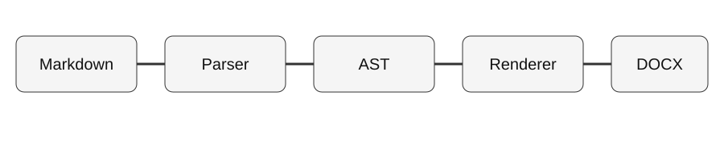

# Phase 3 Production Hardening

This document exercises themes, Unicode, RTL, native equations, SVG conversion, and wide-table
landscape sections while preserving native Word semantics.

## Unicode and RTL

English: café, naïve, Δ, 中文内容, 日本語, 한국어, 🚀.

مرحبا بالعالم — هذا سطر عربي لاختبار خصائص Word ثنائية الاتجاه.

## Native equation

$$
\int_0^\infty e^{-x}\,dx = 1,\qquad
A = \begin{bmatrix} a & b \\ c & d \end{bmatrix}
$$

## SVG architecture

## Wide table

| Component | Input contract | Output contract | Security boundary | Caching | Diagnostics | Phase |
|---|---|---|---|---|---|---|
| Parser | Markdown | Canonical AST | No code execution | — | PARSE | 1 |
| Math | LaTeX subset | OMML | No TeX execution | Per render | MATH | 2–3 |
| Resources | Local/HTTPS image | Safe local bytes | Path/DNS/MIME/size checks | Optional disk | RESOURCE | 3 |
| Renderer | Canonical AST | WordprocessingML | OOXML only | Math cache | DOCX | 1–3 |

## Editable content

- Native numbering remains editable.
- Tables remain native Word tables.
- Equations remain Office Math rather than screenshots.
- Headings remain Word heading styles for TOC rebuilds.
