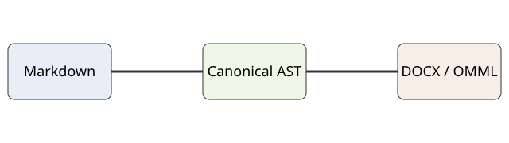

# Phase 4 Operational Maturity

This document exercises **native Word structure**, reproducible packaging, Unicode, RTL text,
editable equations, tables, SVG conversion, and ordinary Markdown semantics.



## Editable mathematics

Inline math remains in the paragraph: $E=mc^2$ and $x_i^2$.

$$
\sum_{i=1}^{n} i = \frac{n(n+1)}{2}
$$

$$
\int_0^\infty e^{-x}\,dx = 1
$$

## Native lists

1. Parse Markdown.
2. Build the canonical AST.
   - Preserve semantics.
   - Preserve source positions.
3. Render WordprocessingML and OMML.

## Unicode and RTL

English remains left-to-right. العربية تظل نصاً أصلياً قابلاً للتحرير داخل Word.

## Wide table

| Component | Parser | Normalizer | Renderer | Equations | Resources | Diagnostics | Validation |
|---|---|---|---|---|---|---|---|
| Representation | tokens | AST | OOXML | OMML | embedded media | JSON/SARIF | package XML |
| Editable | yes | yes | yes | yes | image object | n/a | n/a |
| Deterministic | yes | yes | yes | yes | policy-bound | yes | yes |

## Code remains editable

```python
from mddocx import render
render("report.md", "report.docx")
```

# Completion

The artifact should reopen as a normal DOCX and all semantic structures should remain native.
