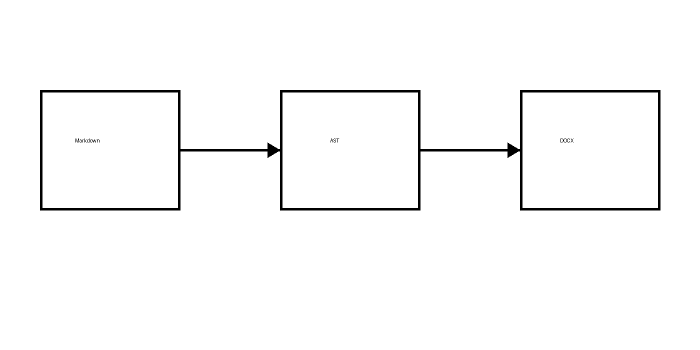
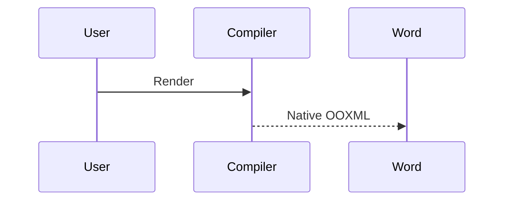
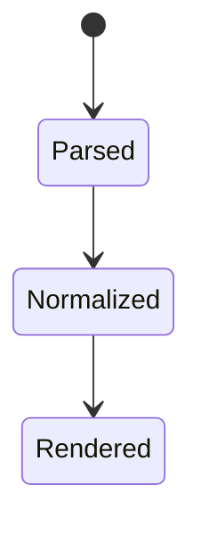
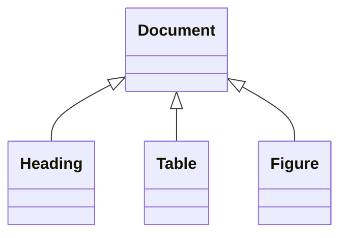
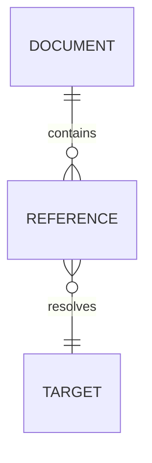
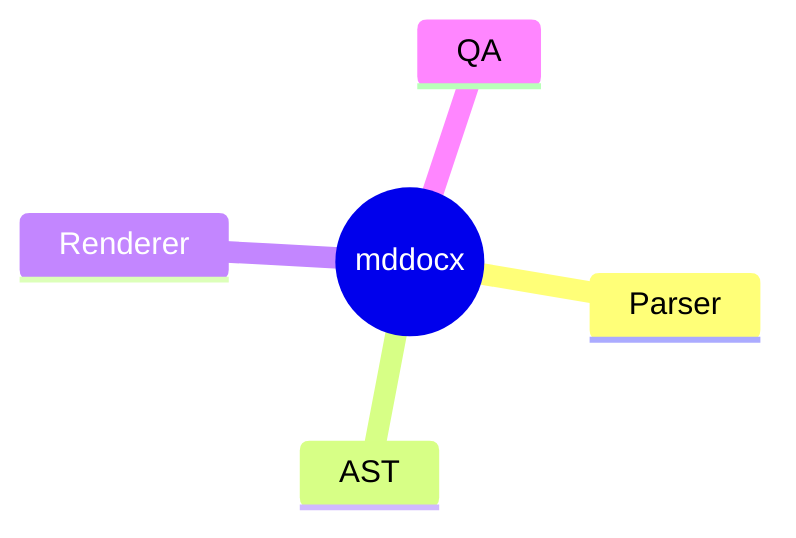
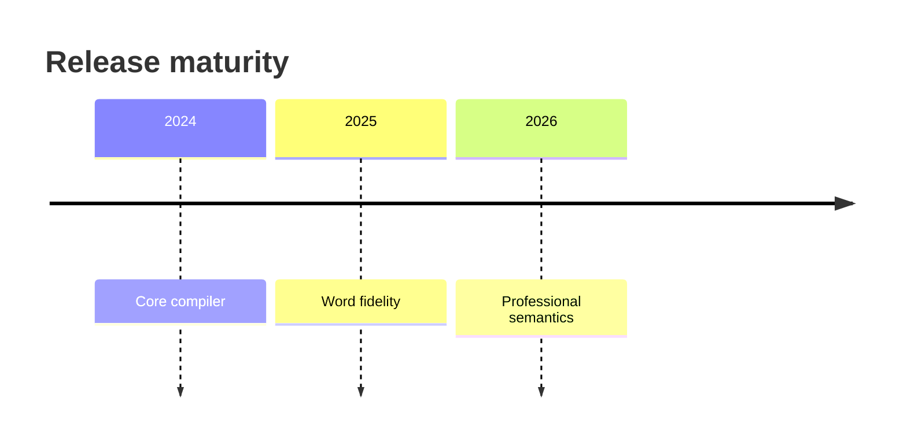
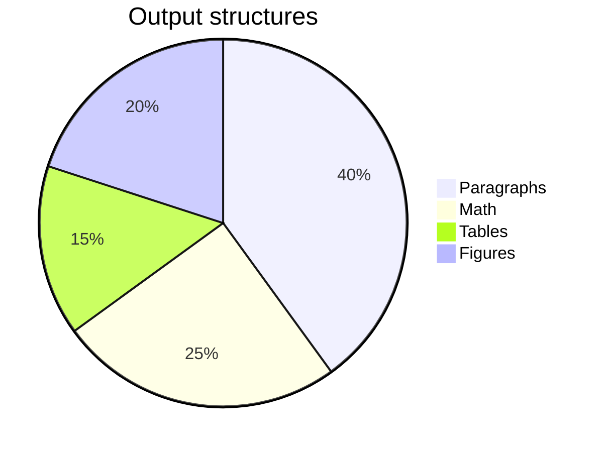

# Section 1: Professional Word Semantics {#sec-1}

This acceptance report validates native references, captions, citations, endnotes, accessibility, and diagrams [@smith2025; @lee2026].

{#fig-architecture width=72% align=center caption="Semantic Markdown-to-Word compilation pipeline"}

As shown in [Figure @fig-architecture], the compiler preserves semantic boundaries. See [Section @sec-2] for numbered equations.

{decorative=true width=90% align=center}

<!-- pagebreak -->

# Section 2: Professional Word Semantics {#sec-2}

Numbered native Office Math is cross-referenceable and remains editable.

$$
E = mc^2
$$ {#eq-energy}

$$
\int_0^\infty e^{-x^2}\,dx = \frac{\sqrt{\pi}}{2}
$$ {#eq-gaussian}

See [Equation @eq-energy] and [Equation @eq-gaussian].

<!-- pagebreak -->

# Section 3: Professional Word Semantics {#sec-3}

| Feature | Native Word structure | Status |
|---|---|---:|
| Equations | OMML | Pass |
| References | REF/SEQ fields | Pass |
| Notes | Endnotes part | Pass |

Table: Phase 5B semantic features {#tbl-features}

The result matrix is summarized in [Table @tbl-features].

<!-- pagebreak -->

# Section 4: Professional Word Semantics {#sec-4}

```python {#lst-render caption="Minimal rendering entry point"}
from mddocx import render
render("input.md", "output.docx")
```

The public entry point remains small; see [Listing @lst-render].

<!-- pagebreak -->

# Section 5: Professional Word Semantics {#sec-5}

Compiler
: A deterministic program that maps Markdown semantics to native Word semantics.

Cross-reference
: A field-backed link whose visible number or target updates with the document.

Bibliography
: A generated reference list backed by BibTeX or CSL-JSON metadata.

<!-- pagebreak -->

# Section 6: Professional Word Semantics {#sec-6}


The offline renderer produced [Figure @fig-diagram-6] without executing Markdown code.

<!-- pagebreak -->

# Section 7: Professional Word Semantics {#sec-7}



The offline renderer produced [Figure @fig-diagram-7] without executing Markdown code.

<!-- pagebreak -->

# Section 8: Professional Word Semantics {#sec-8}



The offline renderer produced [Figure @fig-diagram-8] without executing Markdown code.

<!-- pagebreak -->

# Section 9: Professional Word Semantics {#sec-9}



The offline renderer produced [Figure @fig-diagram-9] without executing Markdown code.

<!-- pagebreak -->

# Section 10: Professional Word Semantics {#sec-10}



The offline renderer produced [Figure @fig-diagram-10] without executing Markdown code.

<!-- pagebreak -->

# Section 11: Professional Word Semantics {#sec-11}



The offline renderer produced [Figure @fig-diagram-11] without executing Markdown code.

<!-- pagebreak -->

# Section 12: Professional Word Semantics {#sec-12}



The offline renderer produced [Figure @fig-diagram-12] without executing Markdown code.

<!-- pagebreak -->

# Section 13: Professional Word Semantics {#sec-13}



The offline renderer produced [Figure @fig-diagram-13] without executing Markdown code.

<!-- pagebreak -->

# Section 14: Professional Word Semantics {#sec-14}

- [x] Native Word checkbox
- [x] Native numbering
- [x] Native endnotes
- [ ] Future Microsoft Word build farm

Task controls remain editable Word content controls.

<!-- pagebreak -->

# Section 15: Professional Word Semantics {#sec-15}

This statement has a native endnote with inline math.[^note-one]

A second endnote includes **bold**, *italic*, and a URL label.[^note-two]

<!-- pagebreak -->

# Section 16: Professional Word Semantics {#sec-16}

Citation rendering is architecture-separated from DOCX rendering [@patel2024, p. 18].

The bibliography is generated on the final page.

<!-- pagebreak -->

# Section 17: Professional Word Semantics {#sec-17}

Section 17 is a pagination and reference stability fixture. It links back to [Section @sec-1] and cites the document compiler literature [@smith2025].

$$
f_{17}(x)=\sum_{k=0}^{17} \frac{x^k}{k!}
$$ {#eq-series-17}

[Equation @eq-series-17] is a section-scoped numbered OMML expression.

| Metric | Value |
|---|---:|
| Section | 17 |
| Equation terms | 18 |

Table: Section 17 metrics {#tbl-metric-17}

<!-- pagebreak -->

# Section 18: Professional Word Semantics {#sec-18}

Section 18 is a pagination and reference stability fixture. It links back to [Section @sec-1] and cites the document compiler literature [@smith2025].

$$
f_{18}(x)=\sum_{k=0}^{18} \frac{x^k}{k!}
$$ {#eq-series-18}

[Equation @eq-series-18] is a section-scoped numbered OMML expression.

| Metric | Value |
|---|---:|
| Section | 18 |
| Equation terms | 19 |

Table: Section 18 metrics {#tbl-metric-18}

<!-- pagebreak -->

# Section 19: Professional Word Semantics {#sec-19}

Section 19 is a pagination and reference stability fixture. It links back to [Section @sec-1] and cites the document compiler literature [@smith2025].

$$
f_{19}(x)=\sum_{k=0}^{19} \frac{x^k}{k!}
$$ {#eq-series-19}

[Equation @eq-series-19] is a section-scoped numbered OMML expression.

| Metric | Value |
|---|---:|
| Section | 19 |
| Equation terms | 20 |

Table: Section 19 metrics {#tbl-metric-19}

<!-- pagebreak -->

# Section 20: Professional Word Semantics {#sec-20}

Section 20 is a pagination and reference stability fixture. It links back to [Section @sec-1] and cites the document compiler literature [@smith2025].

$$
f_{20}(x)=\sum_{k=0}^{20} \frac{x^k}{k!}
$$ {#eq-series-20}

[Equation @eq-series-20] is a section-scoped numbered OMML expression.

| Metric | Value |
|---|---:|
| Section | 20 |
| Equation terms | 21 |

Table: Section 20 metrics {#tbl-metric-20}

<!-- pagebreak -->

# Section 21: Professional Word Semantics {#sec-21}

Section 21 is a pagination and reference stability fixture. It links back to [Section @sec-1] and cites the document compiler literature [@smith2025].

$$
f_{21}(x)=\sum_{k=0}^{21} \frac{x^k}{k!}
$$ {#eq-series-21}

[Equation @eq-series-21] is a section-scoped numbered OMML expression.

| Metric | Value |
|---|---:|
| Section | 21 |
| Equation terms | 22 |

Table: Section 21 metrics {#tbl-metric-21}

<!-- pagebreak -->

# Section 22: Professional Word Semantics {#sec-22}

Section 22 is a pagination and reference stability fixture. It links back to [Section @sec-1] and cites the document compiler literature [@smith2025].

$$
f_{22}(x)=\sum_{k=0}^{22} \frac{x^k}{k!}
$$ {#eq-series-22}

[Equation @eq-series-22] is a section-scoped numbered OMML expression.

| Metric | Value |
|---|---:|
| Section | 22 |
| Equation terms | 23 |

Table: Section 22 metrics {#tbl-metric-22}

<!-- pagebreak -->

# Section 23: Professional Word Semantics {#sec-23}

Section 23 is a pagination and reference stability fixture. It links back to [Section @sec-1] and cites the document compiler literature [@smith2025].

$$
f_{23}(x)=\sum_{k=0}^{23} \frac{x^k}{k!}
$$ {#eq-series-23}

[Equation @eq-series-23] is a section-scoped numbered OMML expression.

| Metric | Value |
|---|---:|
| Section | 23 |
| Equation terms | 24 |

Table: Section 23 metrics {#tbl-metric-23}

<!-- pagebreak -->

# Section 24: Professional Word Semantics {#sec-24}

Section 24 is a pagination and reference stability fixture. It links back to [Section @sec-1] and cites the document compiler literature [@smith2025].

$$
f_{24}(x)=\sum_{k=0}^{24} \frac{x^k}{k!}
$$ {#eq-series-24}

[Equation @eq-series-24] is a section-scoped numbered OMML expression.

| Metric | Value |
|---|---:|
| Section | 24 |
| Equation terms | 25 |

Table: Section 24 metrics {#tbl-metric-24}

<!-- pagebreak -->

# Section 25: Professional Word Semantics {#sec-25}

Section 25 is a pagination and reference stability fixture. It links back to [Section @sec-1] and cites the document compiler literature [@smith2025].

$$
f_{25}(x)=\sum_{k=0}^{25} \frac{x^k}{k!}
$$ {#eq-series-25}

[Equation @eq-series-25] is a section-scoped numbered OMML expression.

| Metric | Value |
|---|---:|
| Section | 25 |
| Equation terms | 26 |

Table: Section 25 metrics {#tbl-metric-25}

<!-- pagebreak -->

# Section 26: Professional Word Semantics {#sec-26}

Section 26 is a pagination and reference stability fixture. It links back to [Section @sec-1] and cites the document compiler literature [@smith2025].

$$
f_{26}(x)=\sum_{k=0}^{26} \frac{x^k}{k!}
$$ {#eq-series-26}

[Equation @eq-series-26] is a section-scoped numbered OMML expression.

| Metric | Value |
|---|---:|
| Section | 26 |
| Equation terms | 27 |

Table: Section 26 metrics {#tbl-metric-26}

<!-- pagebreak -->

# Section 27: Professional Word Semantics {#sec-27}

Section 27 is a pagination and reference stability fixture. It links back to [Section @sec-1] and cites the document compiler literature [@smith2025].

$$
f_{27}(x)=\sum_{k=0}^{27} \frac{x^k}{k!}
$$ {#eq-series-27}

[Equation @eq-series-27] is a section-scoped numbered OMML expression.

| Metric | Value |
|---|---:|
| Section | 27 |
| Equation terms | 28 |

Table: Section 27 metrics {#tbl-metric-27}

<!-- pagebreak -->

# Section 28: Professional Word Semantics {#sec-28}

Section 28 is a pagination and reference stability fixture. It links back to [Section @sec-1] and cites the document compiler literature [@smith2025].

$$
f_{28}(x)=\sum_{k=0}^{28} \frac{x^k}{k!}
$$ {#eq-series-28}

[Equation @eq-series-28] is a section-scoped numbered OMML expression.

| Metric | Value |
|---|---:|
| Section | 28 |
| Equation terms | 29 |

Table: Section 28 metrics {#tbl-metric-28}

<!-- pagebreak -->

# Section 29: Professional Word Semantics {#sec-29}

Section 29 is a pagination and reference stability fixture. It links back to [Section @sec-1] and cites the document compiler literature [@smith2025].

$$
f_{29}(x)=\sum_{k=0}^{29} \frac{x^k}{k!}
$$ {#eq-series-29}

[Equation @eq-series-29] is a section-scoped numbered OMML expression.

| Metric | Value |
|---|---:|
| Section | 29 |
| Equation terms | 30 |

Table: Section 29 metrics {#tbl-metric-29}

<!-- pagebreak -->

# Section 30: Professional Word Semantics {#sec-30}

Section 30 is a pagination and reference stability fixture. It links back to [Section @sec-1] and cites the document compiler literature [@smith2025].

$$
f_{30}(x)=\sum_{k=0}^{30} \frac{x^k}{k!}
$$ {#eq-series-30}

[Equation @eq-series-30] is a section-scoped numbered OMML expression.

| Metric | Value |
|---|---:|
| Section | 30 |
| Equation terms | 31 |

Table: Section 30 metrics {#tbl-metric-30}

## References

::: bibliography
:::

[^note-one]: The endnote contains editable mathematics $\nabla^2 f=0$.

[^note-two]: Endnotes preserve **bold** and *italic* inline formatting and visible link text [OpenAI](https://openai.com).