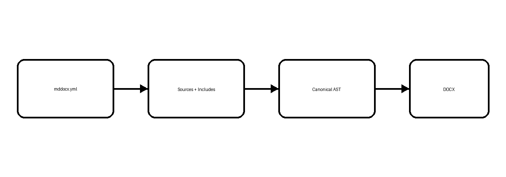

# Introduction {#sec-intro}

This report validates **{{ product }} {{ release }}** as a project-oriented Markdown → Word compiler for {{ audience }}.

{#fig-project width=72% align=center caption="Project build architecture"}

The architecture in [Figure @fig-project] keeps compilation deterministic while allowing a document to be split across multiple source files.

@include ../includes/security-note.md

## Project layout

A project is described by `mddocx.yml`, while chapters remain ordinary Markdown files.

```text {caption="Example project layout" #lst-layout linenos=true}
book/
  mddocx.yml
  chapters/
  includes/
  images/
  references.bib
```

See [Listing @lst-layout] for the minimal directory structure.
